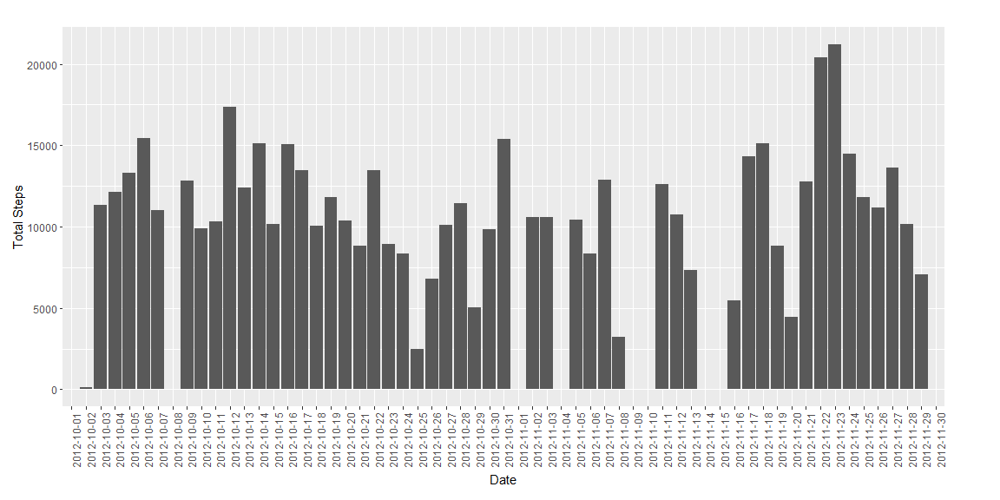
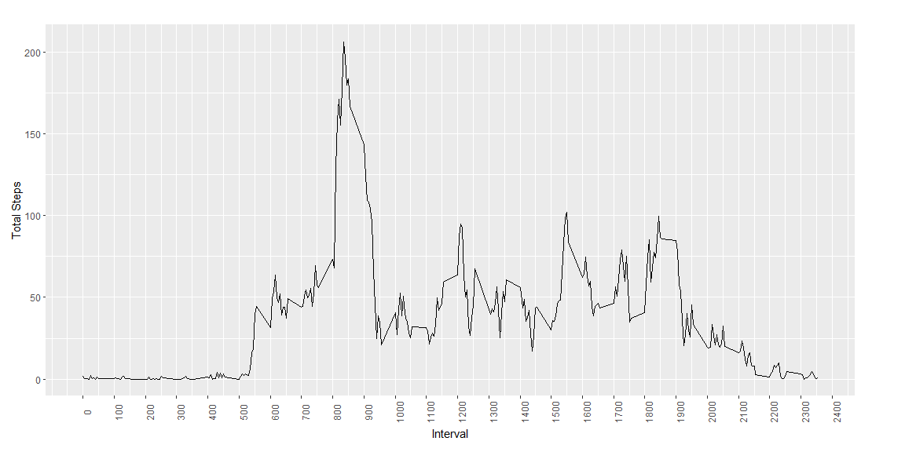
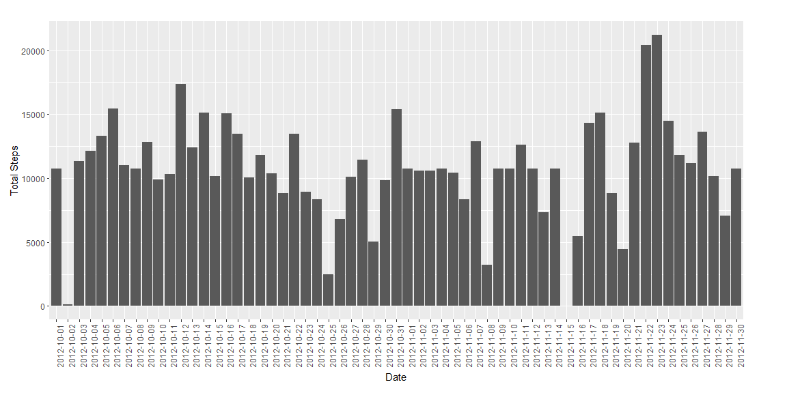
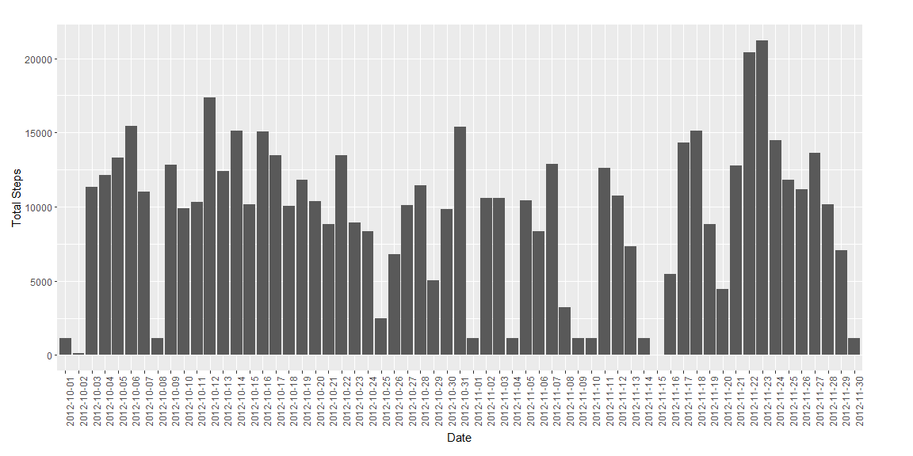
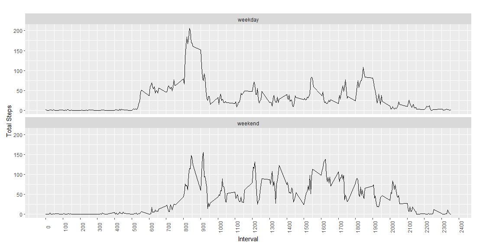

# Reproducible Research: Peer Assessment 1

## Introduction

It is now possible to collect a large amount of data about personal movement
using activity monitoring devices such as a [Fitbit](http://www.fitbit.com),
[Nike Fuelband](http://www.nike.com/us/en_us/c/nikeplus-fuelband), or [Jawbone
Up](https://jawbone.com/up). These type of devices are part of the "quantified
self" movement -- a group of enthusiasts who take measurements about themselves
regularly to improve their health, to find patterns in their behavior, or
because they are tech geeks. But these data remain under-utilized both because
the raw data are hard to obtain and there is a lack of statistical methods and
software for processing and interpreting the data.

This assignment makes use of data from a personal activity monitoring device.
This device collects data at 5 minute intervals through out the day. The data
consists of two months of data from an anonymous individual collected during the
months of October and November, 2012 and include the number of steps taken in 5
minute intervals each day.

## Data

The data for this assignment can be downloaded from the web site:

* Dataset: [Activity monitoring data]
(https://d396qusza40orc.cloudfront.net/repdata%2Fdata%2Factivity.zip) [52K]

The variables included in this dataset are:

* **steps**: Number of steps taking in a 5-minute interval (missing
    values are coded as `NA`)

* **date**: The date on which the measurement was taken in YYYY-MM-DD
    format

* **interval**: Identifier for the 5-minute interval in which
    measurement was taken
    
## Loading and preprocessing the data


Once the data is downloaded, it should be loaded and the **date** variable
converted from a character string into *date* format. At this stage 3 important
libraries are loaded for use with date manipulation and plotting.


```r
# Read the activity data, preprocess and load libraries... 
library(plyr)
library(reshape2)
library(ggplot2)
activity        <- read.csv(dataActivity)
activity$date   <- as.Date(activity$date, "%Y-%m-%d")
```

## What is mean total number of steps taken per day?

To calculate the mean total number of steps per day, the dataset was melted and
reshaped as a summary table giving total steps per day.  


```r
# melt and reshape the activity data to give overall summary... 
melt01.activity <- melt(activity, id.vars="date", measure.vars="steps")
sum01.activity  <- ddply(melt01.activity, .(date), summarise, sum=sum(value))
daily.mean    <- mean(sum01.activity$sum, na.rm=TRUE)
daily.median  <- median(sum01.activity$sum, na.rm=TRUE)
```

The mean and median number of total steps per day are 10766
and 10765 respectively. The summary histogram was generated using ggplot.


```r
# plot histogram of the daily totals... 
g <- ggplot(sum01.activity, aes(x=factor(date), y=sum))
g   + geom_bar(stat="identity") +
    theme(axis.text.x = element_text(angle=90)) +
    theme(plot.margin = unit(c(24,48,12,8),"points")) +
    xlab("Date") + ylab("Total Steps")
```

<!-- -->

## What is the average daily activity pattern?

To calculate the mean number of steps in a given 5 minute interval, the dataset
was melted and reshaped as a summary table giving the mean and the median number
of steps in each 5 minute interval. 


```r
# melt and reshape the activity data to give daily summaries... 
melt02.activity <- melt(activity, id.vars="interval", measure.vars="steps")
sum02.activity  <- ddply(melt02.activity, .(interval), summarise,
        mean=mean(value, na.rm=TRUE), median=median(value, na.rm=TRUE))
interval.max <- sum02.activity[which.max(sum02.activity$mean),1]
```

The 5 minute interval with the highest number of steps averaged across all the
days is 835. The time series plot was again created
using ggplot.


```r
# plot time-series of the mean interval data over the day... 
g <- ggplot(sum02.activity, aes(x=interval, y=mean))
g   + geom_line() +
    scale_x_continuous(breaks=seq(0, 2400, by=100)) +
    theme(axis.text.x = element_text(angle=90)) +
    theme(plot.margin = unit(c(24,48,12,8),"points")) +
    xlab("Interval") + ylab("Total Steps")
```

<!-- -->

## Imputing missing values

```r
# calculate the number of NA's
total.NAs <- sum(is.na(activity$steps))
```

The total number of NA's in the activity dataset is 2304. 

In order to replace the missing values (NA), firstly the mean variable from
summary table giving the mean and median number of steps in each 5 minute
interval was used. The vector of means was repeated by the number of days in the
dataset to generate a vector matching the length of the activity data, and then
substitued in wherever the **steps** variable was equal to NA.


```r
# replace NAs with mean steps for the same interval
activity$stepsNAmean   <- activity$steps
mean.repeat            <- rep(sum02.activity$mean,length(unique(activity$date)))
activity$stepsNAmean[is.na(activity$steps)]   <- mean.repeat[is.na(activity$steps)]

# melt and reshape the new activity data to give overall summary... 
melt03.activity <- melt(activity, id.vars="date", measure.vars="stepsNAmean")
sum03.activity  <- ddply(melt03.activity, .(date), summarise, sum=sum(value))
daily.NAmean.mean    <- mean(sum03.activity$sum, na.rm=TRUE)
daily.NAmean.median  <- median(sum03.activity$sum, na.rm=TRUE)
```
To calculate the mean total number of steps per day, the dataset was melted and
reshaped as before to give the total steps per day. The revised mean and median
are 10766 and 10766
respectively. The summary histogram was again generated using ggplot.


```r
# plot histogram of the daily totals using the mean substitution... 
g <- ggplot(sum03.activity, aes(x=factor(date), y=sum))
g   + geom_bar(stat="identity") +
    theme(axis.text.x = element_text(angle=90)) +
    theme(plot.margin = unit(c(24,48,12,8),"points")) +
    xlab("Date") + ylab("Total Steps")
```

<!-- -->

It was observed that the median variable from the summary table giving the mean
and median number of steps in each 5 minute interval might give an alternative
method of replacing the missing (NA) values. The substitution was repeated as
before using a replacement vector created of by repeating the vector of medians
by the number of days.


```r
# replace NAs with median steps for the same interval
activity$stepsNAmedian <- activity$steps
median.repeat          <- rep(sum02.activity$median,length(unique(activity$date)))
activity$stepsNAmedian[is.na(activity$steps)] <- median.repeat[is.na(activity$steps)]

# melt and reshape the new activity data to give overall summary... 
melt04.activity <- melt(activity, id.vars="date", measure.vars="stepsNAmedian")
sum04.activity  <- ddply(melt04.activity, .(date), summarise, sum=sum(value))
daily.NAmedian.mean    <- mean(sum04.activity$sum, na.rm=TRUE)
daily.NAmedian.median  <- median(sum04.activity$sum, na.rm=TRUE)
```

To calculate the mean total number of steps per day, the dataset was once again
melted and reshaped as before to give the total steps per day. The revised mean
and median are 9503 and 10395
respectively. The summary histogram was again generated using ggplot.


```r
# plot histogram of the daily totals using the median substitution... 
g <- ggplot(sum04.activity, aes(x=factor(date), y=sum))
g   + geom_bar(stat="identity") +
    theme(axis.text.x = element_text(angle=90)) +
    theme(plot.margin = unit(c(24,48,12,8),"points")) +
    xlab("Date") + ylab("Total Steps")
```

<!-- -->

Comparison of the shapes of the histograms of the uncorrected data and for the
data with NA substitution by the mean and median respectively shows that the
latter is a better match to the original data. The median substitution was
therefore used for the final part of the assignment.

## Are there differences in activity patterns between weekdays and weekends?

The activity data was assigned a factor variable **daytype** stating whether it
was recorded on a weekday or at a weekend. 


```r
weekdays <- c("Monday", "Tuesday", "Wednesday", "Thursday", "Friday")
weekends <- c("Saturday", "Sunday")
activity$weekdays <- weekdays(activity$date)
activity$daytype[activity$weekdays %in% weekdays] <- "weekday"
activity$daytype[activity$weekdays %in% weekends] <- "weekend"
activity$daytype <- as.factor(activity$daytype)
```

The activity dataset was melted and reshaped as before to give a summary table
giving the mean and median number  of steps in each 5 minute interval. This time
the summary table was generated as a function of both **interval** and
**daytype**, allowing ggplot to be used to generate a multipanel time series
plot illustrating the difference between weeday and weekend activity.


```r
# melt and reshape the activity data to give daily summaries... 
melt05.activity <- melt(activity, id.vars=c("interval","daytype"), measure.vars="stepsNAmedian")
sum05.activity  <- ddply(melt05.activity, .(interval,daytype), summarise,
        mean=mean(value, na.rm=TRUE), median=median(value, na.rm=TRUE))
```


```r
# plot time-series of the mean interval data over the day for both weedays and weekends... 
g <- ggplot(sum05.activity, aes(x=interval, y=mean))
g   + geom_line() + facet_wrap(~daytype, ncol=1) +
    scale_x_continuous(breaks=seq(0, 2400, by=100)) +
    theme(axis.text.x = element_text(angle=90)) +
    theme(plot.margin = unit(c(24,48,12,8),"points")) +
    xlab("Interval") + ylab("Total Steps")
```

<!-- -->
